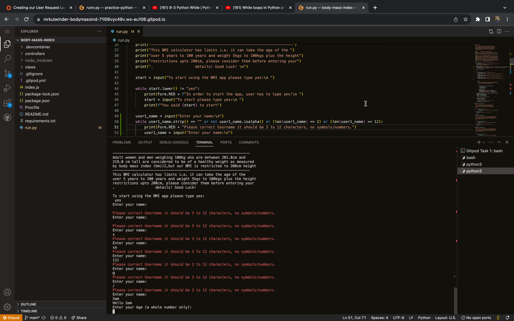

# BODY MASS INDEX

Body Mass Index in short BMI is a Python terminal calculator which takes the user's information and, calculates their BMI as per their weight and height. It also identifies if their provided details are valid and at the end it informs the user if their weight is good as per the BMI or if they are overweight.
It is very clearly and simply designed software which is compatible to work on Heroku app.

here is live version of the [BODY MASS INDEX](https://body-mass-index.herokuapp.com/)
 

# How does it work:
It is very easy to use and understand, a userfiendly design where you just have to enter your details (Name, Age, Weight and Height) if any of the provided detail is incorrect it will warn you and give you another chance to try again to enter your details. Finally if all the details are correct and valid it will then calculate the BMI and print the results with a very brief message saying "Your weight is good as per BMI calculations" or "Sorry your weight is a bit high". The app does not store the user's data or any other  and special credentials information and can be used multiple times. In the end, it asks the user if he/she wants to continue using or end the programme.

 

# Contents
* [**User Experience**](<#user-experience>)
    * [User Stories](<#user-stories>)
    * [Existing Features](<#existing-features>)
    * [Flow Chart](<#flow-charts>)
    * [Testing & Bugs](<#testing--bugs>)
    * [Unfixed Bugs](<>)
    * [Colours & Simplicity](<#colours--simplicity>)
    * [Technologies used](<#technologies-used>)
    * [Future Changes](<#future-changes>)
    * [Deployment](<#deployment>)
    * [Forking the repository](<#forking-the-respository>)
    * [Credits & Acknowledgment](<#credits--acknowlegement>)

# User Experience #

## User Stories ##
- As a user I would like to have an easy to use interface with clear instructions which Body Mass Index has.
- As a user, I would like not like to save my details in their database and I am happy that BMI doesn't save.
- As a user, I am curious to know if I am in the good BMI range or not, it gives a reason to eat healthy and not to be overweight. 
- As a user, I am happy to use it multiple times.

 

## Existing Features ##

- Clear and simple design.
- Welcome page starts with the nice ASCII text format, written BODY MASS INDEX which clearly indicates what it is for.

 

 

- Very easy to use
- User-friendly.
- Easy instructions just follow the prompts.

- Multiple tests have been carried out to check  and verify the app is working propely and not crashing. Manual testing proved if the wrong, empty and invalid inputs would be entered by the user, the app will trigger an error  and give a chance to fix the error. However for the numerical errors app will run through all the way and then show the error and inform the user that he has to enter the details again. This will only happen if the user enters an inappropriate entry for the age, weight and height otherwise app runs and while loop will be reprompted to enter the required input.

-  .

 

-  .

 

-  .

 

-  .

 

-  .

 

-  .

 

-  .

- Exception and error handling:
Error and exceptions have been carefully coded and triggering an error is very common in general use of the app. Any empty space, enter withoug typing anything entering string instead of a number, entering a number with decimal point everything has been taken into consideration while handling the errors and exceptions. User have been given another opportunity to enter the details again every time and not kicked out of the app.

 

- Does not ask for private detail other than the basic body measurements, age & name. 
- Good BMI is presented with a nice green colour text message.
- Overweight is informed with a polite message but in red colour.
- Exception and rare statements to help extra-ordinary tall and heavy weight users.
- Limits and restrictions are in place.

 

## Flow Charts ##
The flow chart has been added and generated by [Lucid Chart](https://www.lucidchart.com). it shows the flow and process of the data going through the different stages and pass the validity test and criteria to reach the end and finally generate the result with a brief message. It also shows the revert stages and to get another chance to the user to try using the app again rather quitting.

 

# Testing & Bugs #
- I got a list of errors while testing, All the known errors were removed (known errors i.e blank spaces, blank lines, trailing spaces, characters exceeding the limit of 80 etc.). No serious error or bugs were found when testing the code through [PEP8](https://pep8ci.herokuapp.com/) validator.
- All the codes written are tested by [PEP8](https://pep8ci.herokuapp.com/) validator's link was provided by the [Code Institute](https://codeinstitute.net/ie/) 
-  .

 

- .

# Unfixed Bugs #

- Bugs - This has been challenging situation for me and majority of the errors and bugs have been removed. While implementing the while loop I was unable to fix the open bugs, so when the user enters an input for the age (as the app is restricted over 16 to 100 years of age), it can not accept under 16 which is 15 or any younger age, here the while loop does not break and continue to the end of the programme until the prompts will finish and then triggers the error and warn the user. 

This for the user age when the programme finishes it is still in the loop and can regenerate the results with new data. However for the weight and height it does not break and exit the loop without giving a chance to correct the data input again. This bug was very stressing and I tried hard to fix but no success unfortunately. 

Other than the above bugs and errors application does not break or kicks out the user for any reason, all the codes have been validated by the pep8 validator.

 

# Colours & Simplicity #
Multiple colours have not been used to keep the design of the app very simple and clear according to the mock terminal and app layout. Though there is text colour variation between the good BMI presentation and overweight with the different colour text messages. Only 2 colour codes have been used '\033[32m' and '\033[31m'  Colours have been taken from the Colorama module. This module is not a built-in module in Python, but it has been installed through the pip install method.

# Technologies used #
Basic code structure is written in Python3 the latest version of Python, some of the contents of the code are not built in libraries and modules. Colorama and Pyfiglet, figlet format were downloaded and installed through the pip3 installer and sent to Heroku via requirements file for deployment, it has been deployed through Heroku's mock terminal's set format app(a standard app for students). Pyfiglet was used to give a nice welcome page look through the ASCII text.

# Future Changes #

I would make an improvement in future and add a list comprehension to turn the strings into integers to help users to enter integers only while entering the data. I would also give more feedback and suggestions for a healthy weight as per BMI.

# Deployment #

The project was deployed using the Code Institute's mock terminal for Heroku
the following steps were used to deploy:
- Fork the repository.
- Create a new Heroku app, as per the requirement for deployement.
- Two main build packs Python and Nodejs were set 1st Python and Nodejs.
- Then link the repository to the Heroku app.
- Then click on Deploy and only in a few minutes the app was ready to use.

 

# Forking the respository #

By forking the GitHub Repository we make a copy of the original repository on our GitHub account to view and/or make changes without affecting the original repository by using the following steps...

- Log in to GitHub and locate the [GitHub Repository](https://github.com/)
- At the top of the Repository (not top of page) just above the "Settings" Button on the menu, locate the "Fork" Button.
- You should now have a copy of the original repository in your GitHub account.

# Credits & Acknowlegement #

- All support & sources supplied by [Code Institute](https://codeinstitute.net/ie/) for the deployment terminal and all other sources provided for testing and teaching python essential.
- My mentor Darío Carrasquel helped me throughout the project.
- Great support by the Tutors Rebecca and Alan from Code Institute
- Google search engine for helpful tips.
